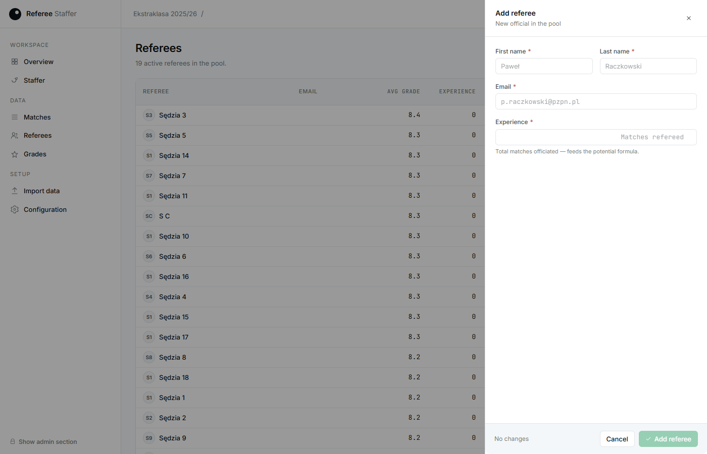
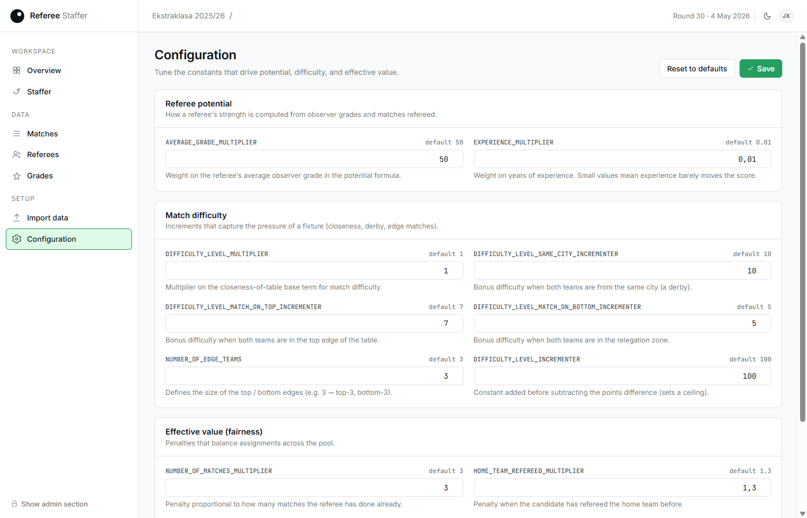
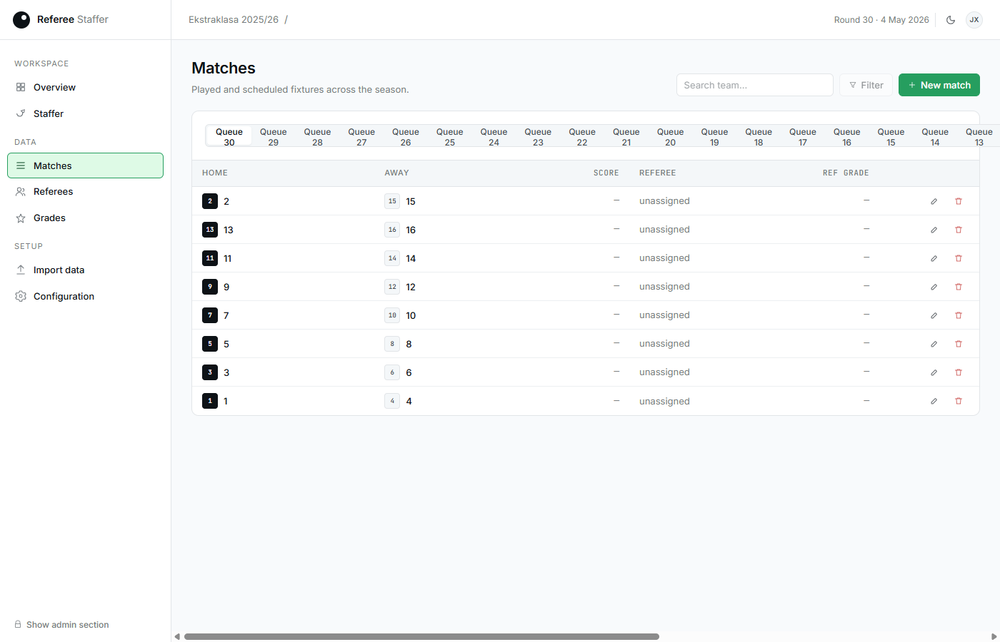
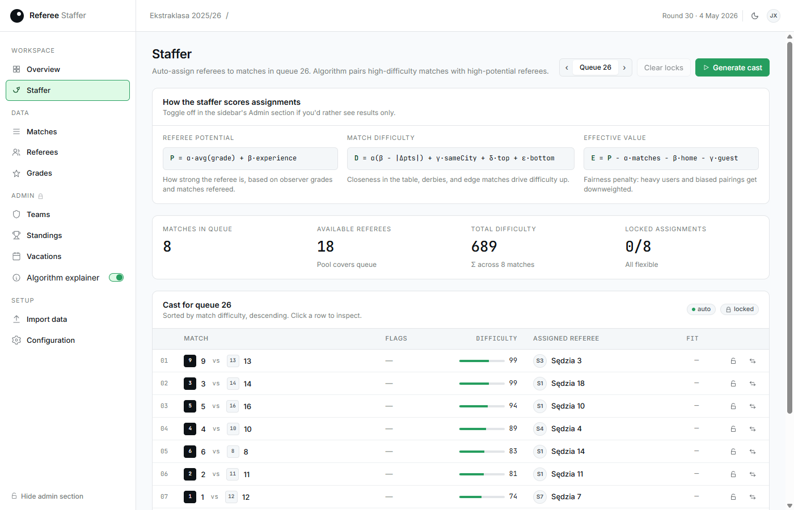
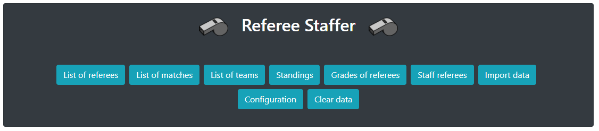

# Referee Staffer

## How it works

In all formulas $\alpha, \beta, \gamma, \delta, \epsilon$ - constants

### Referee's potential

$$P_{i}^{q} = \alpha \frac{\sum_{j=1}^{n_{i}} G_{i}^{j}}{n_{i}} + \beta E_{i}^{q-1}$$

where

$0 \leq n_{i} < q$  
$P_{i}^{q}$ - potential of referee $i$ in queue $q$  
$n_{i}$ - number of grades from observers received by referee $i$  
$G_{i}^{j}$ - grade $j$ of referee $i$  
$E_{i}^{q-1}$ - number of all matches refereed by referee $i$ until queue $q-1$

### Match's difficulty

[//]: # (TODO is alpha needed?)

$$D_{i}^{q} = \alpha (\beta - |P_{i}^{q-1}|) + \gamma C_{i} + \delta T_{i}^{q-1} + \epsilon L_{i}^{q-1}$$

where

$D_{i}^{q}$ - difficulty of match $i$ in queue $q$  
$P_{i}^{q-1}$ - points difference between teams in match $i$ after queue $q-1$  
$$C_{i} = \begin{cases} 1 & \text{teams in match } i \text{ are from the same city} \\ 0 & \text{in other case} \end{cases}$$

$$T_{i}^{q-1} = \begin{cases} 1 & \text{teams in match } i \text{ are in the top 3 in standings after queue } q-1 \\ 0 & \text{in other case} \end{cases}$$

$$L_{i}^{q-1} = \begin{cases} 1 & \text{teams in match } i \text{ are in the last 3 in standings after queue } q-1 \\ 0 & \text{in other case} \end{cases}$$

### Referee's effective value

[//]: # (TODO maybe sum H and G and get rid off one constant)

$$E_{i}^{q} = P_{i}^{q} - \alpha C_{i}^{q-1} - \beta H_{i}^{q-1} - \gamma G_{i}^{q-1}$$

where

$E_{i}^{q}$ - effective value of referee $i$ in queue $q$  
$P_{i}^{q}$ - potential of referee $i$ in queue $q$  
$C_{i}^{q-1}$ - number of matches refereed by referee $i$ until queue $q-1$  
$H_{i}^{q-1}$ - number of home team matches to be refereed by referee $i$ until queue $q-1$  
$G_{i}^{q-1}$ - number of guest team matches to be refereed by referee $i$ until queue $q-1$

## Sample screenshots

### Adding data (referees, teams, matches)

### Changing configuration

### List of matches

### Staffer

### Admin panel

To enable admin panel type in DevTools `admin.hidden=false`

