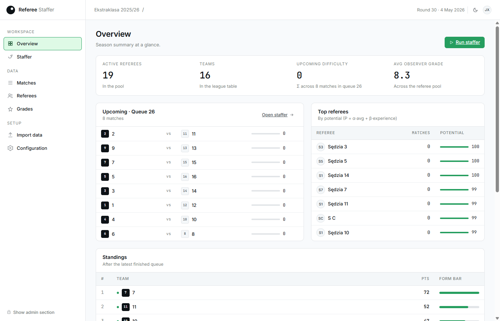
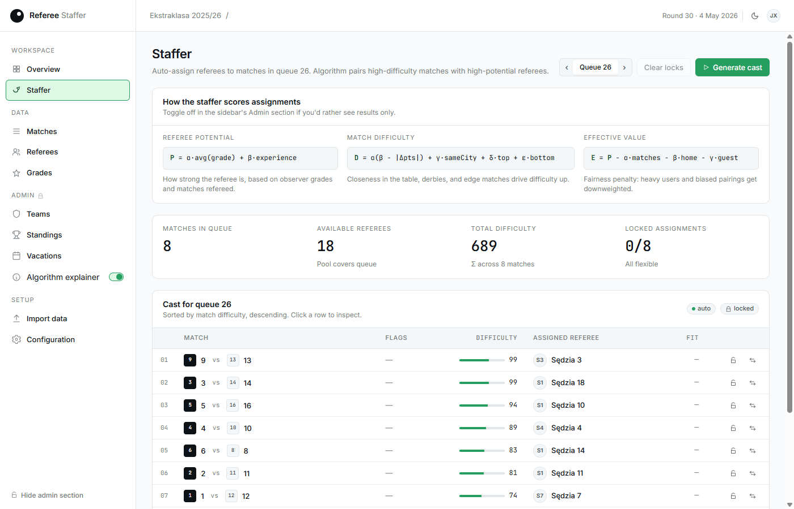
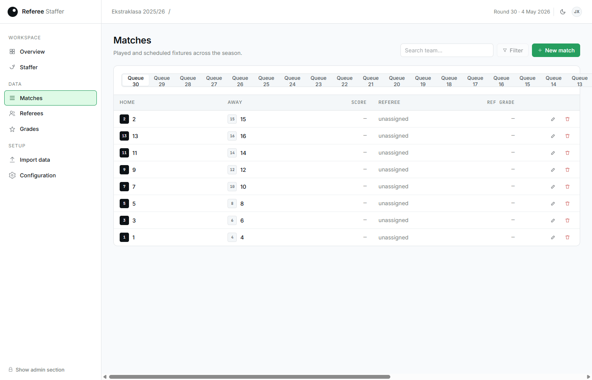
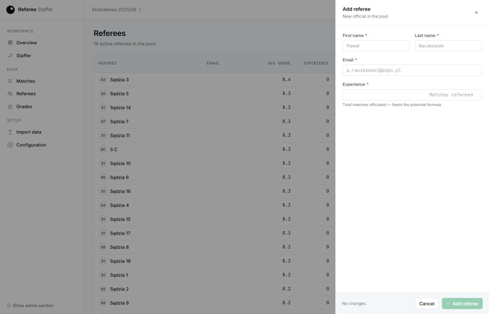
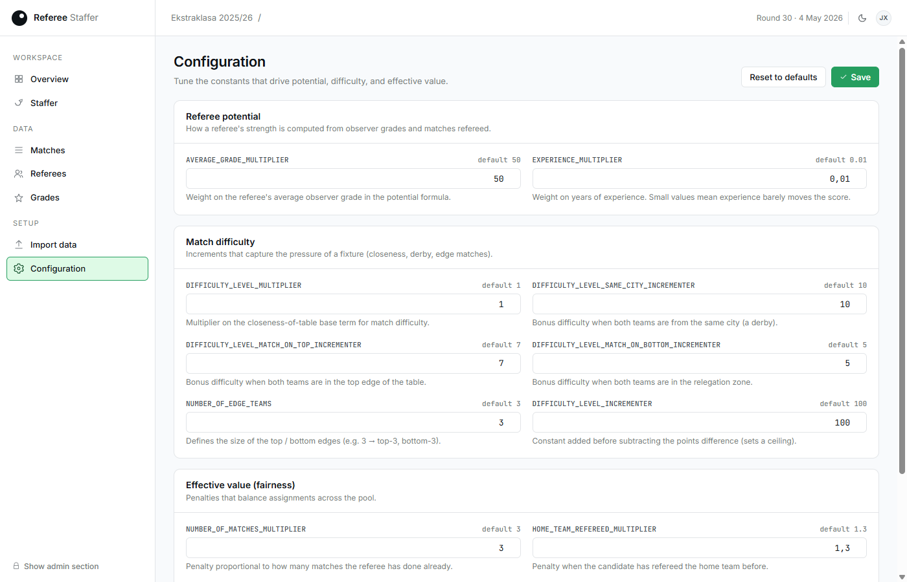
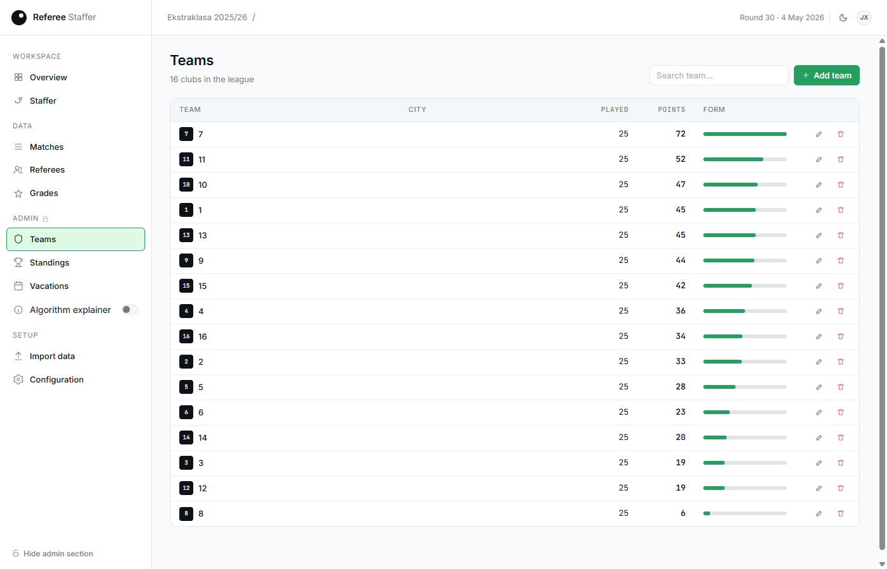
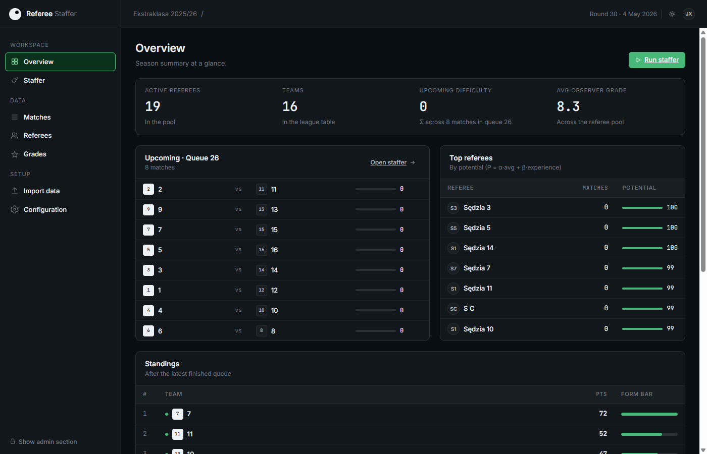

# Referee Staffer

## How it works

Staffing a queue of matches is a three-part scoring model, one part per group in
[`ConfigName`](src/main/java/com/jamex/refereestaffer/model/entity/ConfigName.java): a
referee **potential**, a match **difficulty**, and a referee **effective value** (the score
actually used to pick a referee for a match). Every coefficient below is a row in the `config`
table, seeded by [`data.sql`](src/main/resources/data.sql) and editable at runtime via
`/api/configuration` (the Configuration screen). The default seed values are shown in brackets.

The authoritative implementations are
[`StafferService`](src/main/java/com/jamex/refereestaffer/service/StafferService.java) (potential
/ effective value + assignment) and
[`MatchService`](src/main/java/com/jamex/refereestaffer/service/MatchService.java) (difficulty) —
prefer them over these formulas if the two ever disagree again.

### Referee's potential

The "display" potential shown on the referee screens
(`RefereeService.enrichWithStats`) — average observer grade plus a small experience term:

$$P_{i} = \alpha \cdot \frac{\sum_{j=1}^{n_{i}} G_{i}^{j}}{n_{i}} + \beta \cdot E_{i}$$

where

$\alpha$ = `AVERAGE_GRADE_MULTIPLIER` [50.0], $\beta$ = `EXPERIENCE_MULTIPLIER` [0.01]  
$G_{i}^{j}$ - observer grade $j$ of referee $i$; $n_{i}$ - number of grades received  
$E_{i}$ - referee $i$'s experience (a stored attribute)

When a referee has no grades yet, the average falls back to `DEFAULT_GRADE` [8.3] instead of
dividing by zero. Note the default weights make experience almost irrelevant next to grades
(0.01·years vs 50·grade) — this is a known imbalance tracked separately, not a documentation
error.

### Match's difficulty

`MatchService.computeBreakdown` — a base term that rewards evenly-matched fixtures, plus
optional bonuses for a same-city derby and for both teams sitting at an edge of the table:

$$D_{i} = \mu \cdot (\lambda - |\Delta P_{i}|) + \sigma \cdot C_{i} + \tau \cdot T_{i} + \beta_{L} \cdot L_{i}$$

where

$\mu$ = `DIFFICULTY_LEVEL_MULTIPLIER` [1.0], $\lambda$ = `DIFFICULTY_LEVEL_INCREMENTER` [100.0]  
$\Delta P_{i}$ - absolute difference in league points between the two teams in match $i$ (closer teams ⇒ harder match)  
$\sigma$ = `DIFFICULTY_LEVEL_SAME_CITY_INCREMENTER` [10.0], $\tau$ = `DIFFICULTY_LEVEL_MATCH_ON_TOP_INCREMENTER` [7.0], $\beta_{L}$ = `DIFFICULTY_LEVEL_MATCH_ON_BOTTOM_INCREMENTER` [5.0]  
$N$ = `NUMBER_OF_EDGE_TEAMS` [3], $M$ - total number of teams in the standings

$$C_{i} = \begin{cases} 1 & \text{both teams share a (non-null) city — a derby} \\ 0 & \text{otherwise} \end{cases}$$

$$T_{i} = \begin{cases} 1 & \text{both teams' places} \leq N \text{ (top edge)} \\ 0 & \text{otherwise} \end{cases}$$

$$L_{i} = \begin{cases} 1 & \text{both teams' places} > M - N \text{ (bottom edge)} \\ 0 & \text{otherwise} \end{cases}$$

The edge is configurable, not the hard-coded "top 3 / last 3" this README used to describe: with
the default $N = 3$ it happens to mean top-3 / bottom-3. At most one of $T_{i}$, $L_{i}$ can be 1.
Both bonuses are suppressed when either team has no place yet (a team that hasn't appeared in a
finished match has place $0$; without this guard $0 \leq N$ would misclassify it as a top-edge
side).

### Referee's effective value

`StafferService.countRefereePotentialLvl` — the score that actually drives assignment. It takes
the potential and subtracts fairness penalties that depend on the specific candidate match:

$$V_{i} = P_{i} - \gamma \cdot m_{i} - \delta \cdot H_{i} - \epsilon \cdot A_{i}$$

where

$P_{i}$ - referee $i$'s potential (grade + experience terms above)  
$\gamma$ = `NUMBER_OF_MATCHES_MULTIPLIER` [3.0], $\delta$ = `HOME_TEAM_REFEREED_MULTIPLIER` [1.3], $\epsilon$ = `AWAY_TEAM_REFEREED_MULTIPLIER` [1.3]  
$m_{i}$ - number of matches referee $i$ has already been assigned (spreads the workload)  
$H_{i}$ / $A_{i}$ - how many times referee $i$ has already refereed this match's home / away team (avoids over-familiarity)

### Assignment

`StafferService.staffReferees` processes a queue greedily: matches are sorted by difficulty
descending, and for each match the available referee with the highest effective value $V_{i}$ is
assigned and marked busy for the rest of the run. A referee is "available" when they are not
already assigned in this run and are not on vacation on the match date.

## Sample screenshots

### Overview dashboard

### Staffer

The scoring-formula panel ("Algorithm explainer") can be toggled from the sidebar's Admin section.

### List of matches

### Adding data (referees, teams, matches)

Add/edit forms open as right-side drawers on top of their lists.

### Changing configuration

### Admin panel

The Admin nav group (Teams · Standings · Vacations) is hidden by default. Reveal it with the
"Show admin section" button at the bottom of the sidebar — a temporary stand-in until real
authorization lands.

### Dark mode

Toggle with the sun/moon button in the top bar.

