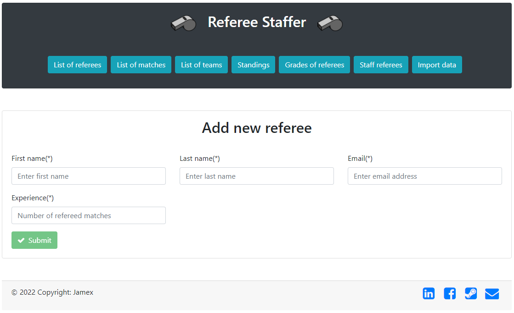
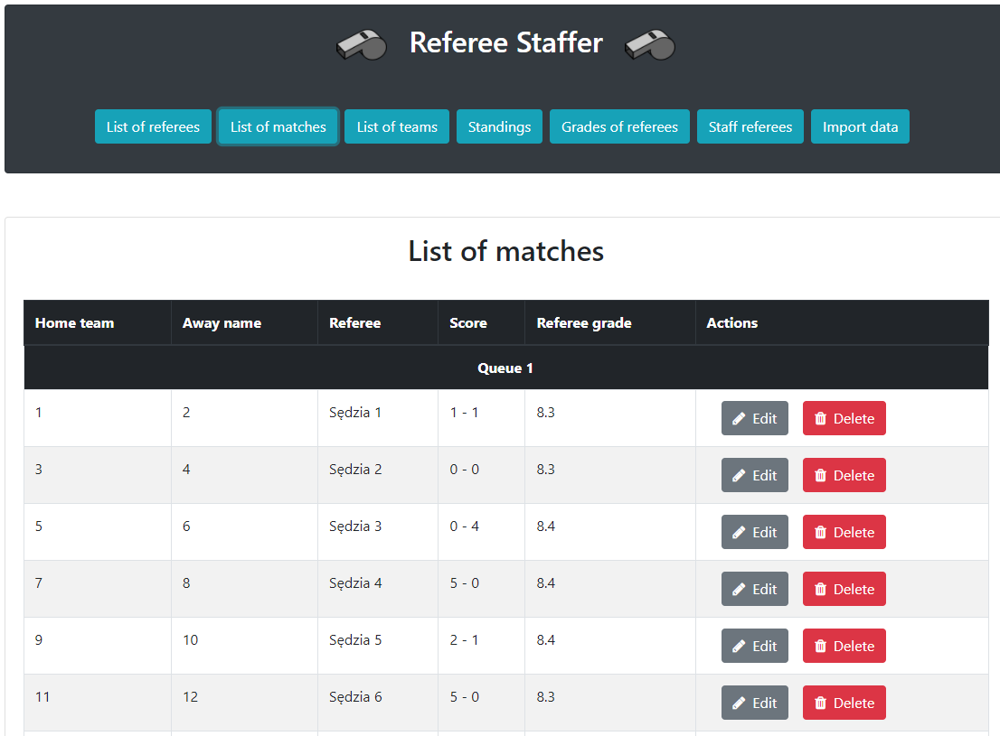

# Referee Staffer

## How it works

In all formulas

### Referee's potential

where

 
 
 
 

### Match's difficulty

[//]: # (TODO is alpha needed?)

where

 
 
 
 

### Referee's effective value

[//]: # (TODO maybe sum H and G and get rid off one constant)

where

 
 
 
 

## Sample screenshots

### Adding data (referees, teams, matches)

### Changing configuration

### List of matches

### Staffer

